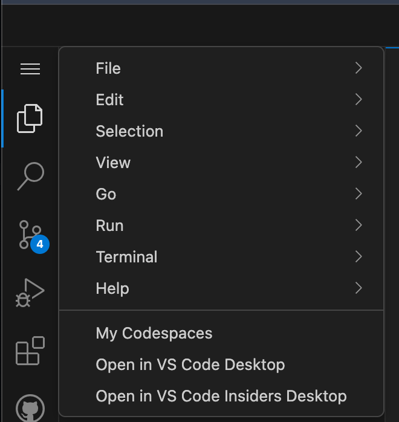
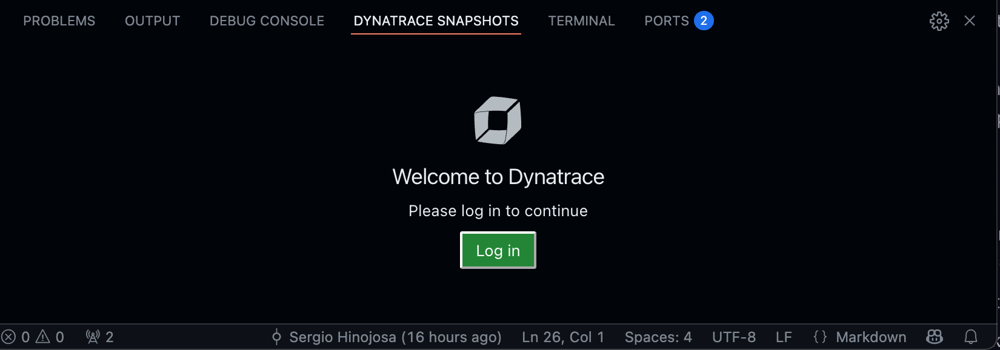

--8<-- "snippets/ide-integration.js"

!!! example "🧑‍💻 IDE Integration"
    We love Developers and the developer's experience, we understand that for better and faster Software development a developer does not leave it's IDE. We support JetBrains and VSCode as one of the most common IDE's out there. [Here you can read more about the extensions](https://docs.dynatrace.com/docs/observe/applications-and-microservices/developer-observability/offering-capabilities/ide-integration).

## Launch the IDE from your Browser

On the top left, click on the VS Code menu (the 3 lines), and then click on "Open in VS Code Desktop". This will launch your local VS Code IDE. If you don't have VS Code already installed in your computer, you can download and install it directly from here: [https://code.visualstudio.com/](https://code.visualstudio.com/){ :target="_blank" }

{ width="300" }

[Download VS Code](https://code.visualstudio.com){ :target="_blank" .md-button }

## Codespaces experience in your IDE

Now your Codespace is open inside your VS Code IDE. You'll notice that you have now the full IDE experience, you can drag and drop files inside and outside the IDE from your OS and VSCode will automatically add them in the container that is being managed by your codespace. 

The application is now being exposed and mapped to your localhost. In this case the TODO app is being mapped to port 30100, so you will be able to access it like this: [http://127.0.0.1:30100](http://127.0.0.1:30100){:target="_blank"}

## Get the Dynatrace extension

On the left pane, click on "Extensions", then search for "Dynatrace" > Select "Observability for Developers" and click on "Install in Codespaces"

## Select the stage you want to connect

Great! now that you have the Dynatrace extension installed in your IDE. Unless you are using a DEV or Hardening (sprint) tenant, this configuration is not needed since th default is "production". All our Free Trials and customers run in production environments. 
If you are using a DEV or sprint tenant, here is how to configure it. Inside the extension, click on the "settings wheel" > select "Settings" and click on it.

The extension settings will open. You can select the environment you want to connect. As options you'll get:

1. development  
2. sprint       
3. production (default)

Select the desired environment and that's it. You can select it for the User, Remote CS instance and for the Workspace.

## Login to Dynatrace SSO

Now let's login to the environment using SSO. On the bottom pane, there is a tab called "Dynatrace Snapshots", open it.  Click on the button "Log in".

This will open a browser and will pass on the SSO credentials to your IDE via http://localhost:3232. When the browser tab opens, enter your credentials, login and accept the pop up to connect back to VS Code. 

## Select the tenant 

Since we are using the comfort of SSO, you can select any tenant you have permission on the logged in production or whatever environment you previously selected. For selecting a specific tenant click on the cloud icon in the Dynatrace Snapshots tab, and the tenants you have permissions will appear.

## Select a running container

...

## Set a non-breaking breakpoint

... live breakpoints, breakpoint status & editor

- [Click here to continue :octicons-arrow-right-24:](mask-data.md)

